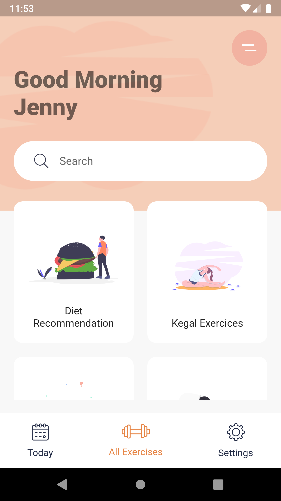
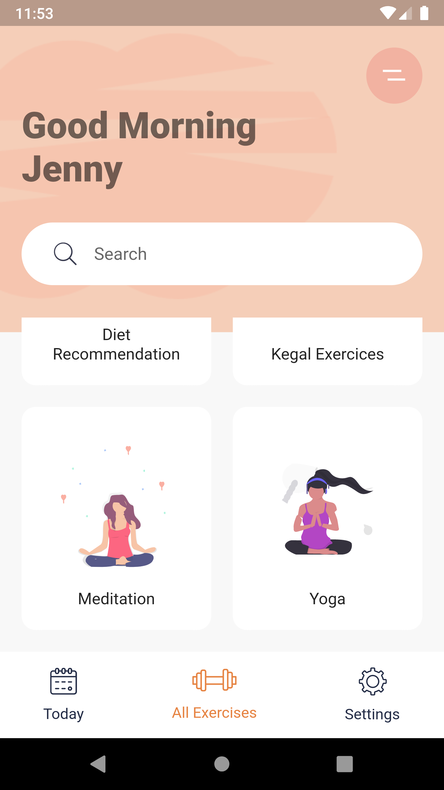
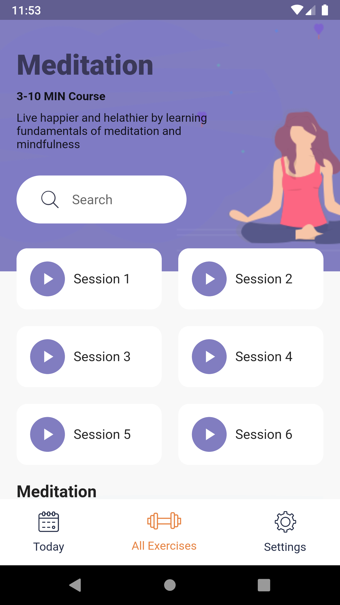

# meditation_app

---ScreenShots & Videos---

 |    |  

https://user-images.githubusercontent.com/102043234/170824647-dbc3a281-392d-4297-8b84-492441e9abfe.mp4

Inspired on: [https://www.youtube.com/watch?v=F4ptWMYYmrU](https://www.youtube.com/watch?v=QpBwHoqxIGc)

## Getting Started

This project is a starting point for a Flutter application.

A few resources to get you started if this is your first Flutter project:

- [Lab: Write your first Flutter app](https://flutter.dev/docs/get-started/codelab)
- [Cookbook: Useful Flutter samples](https://flutter.dev/docs/cookbook)

For help getting started with Flutter, view our
[online documentation](https://flutter.dev/docs), which offers tutorials,
samples, guidance on mobile development, and a full API reference.
